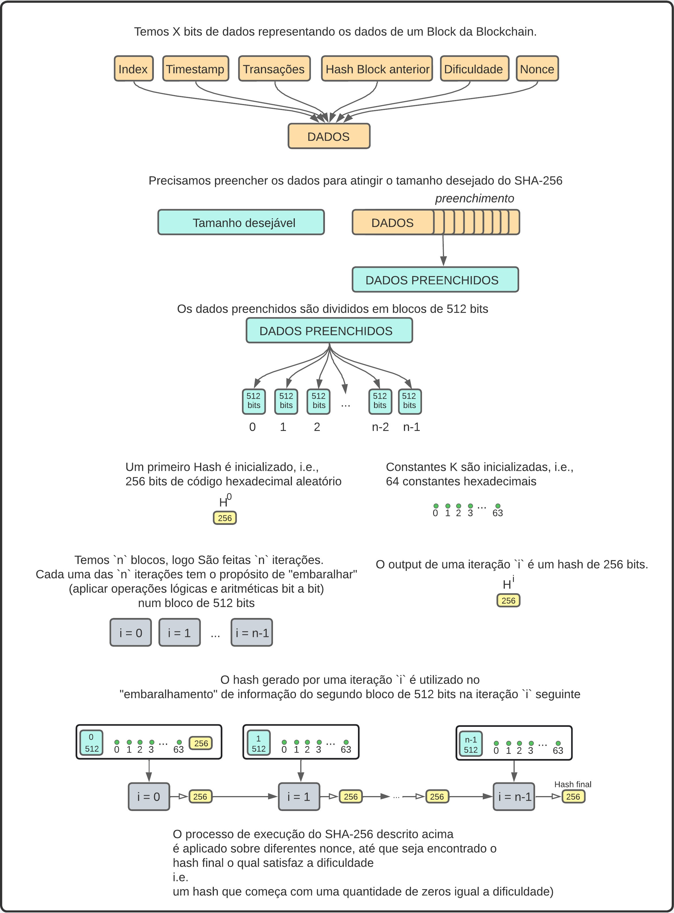
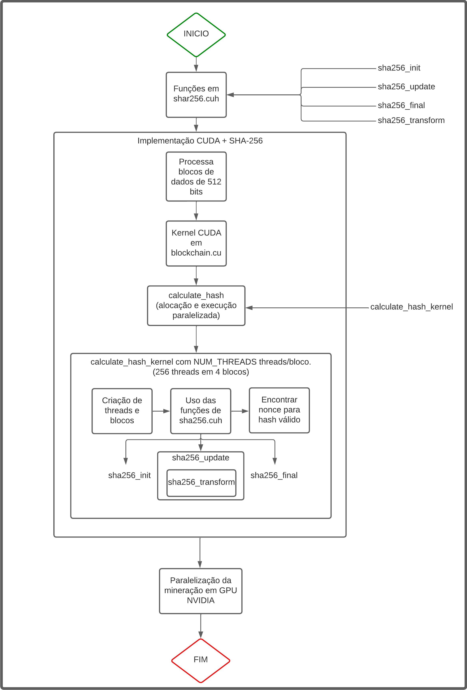

[![CC BY 4.0][cc-by-shield]][cc-by]

# ParalellCryptoMining
This project focuses on optimizing cryptocurrency mining through parallelism, comparing the efficiency of OpenMP (CPU) and CUDA (GPU) against a sequential C baseline.

## Project Description
This project focuses on optimizing cryptocurrency mining through parallelism, comparing the efficiency of OpenMP (CPU) and CUDA (GPU) against a sequential C baseline. The implementation includes the following components:
- **SHA-256 Algorithm**: Utilized for hashing blocks in the blockchain.
- **Blockchain Structure**: Implementation of a simple blockchain to demonstrate cryptocurrency mining.
- **Parallelization Techniques**: Employing OpenMP for CPU parallelism and CUDA for GPU parallelism.
- **Performance Comparison**: Comprehensive benchmarks comparing the sequential, OpenMP, and CUDA implementations.

### Mining Process Overview
The mining process involves solving a cryptographic puzzle by finding a nonce that results in a hash with a specific number of leading zeros, determined by the difficulty level. The process includes the following steps:
1. Create a Genesis Block: Initialize the first block in the blockchain.
2. Add Blocks: Add new blocks with data and link them through hashes.
3. Calculate Hash: Compute the SHA-256 hash based on the block content.
4. Validate Hash: Check if the hash meets the difficulty criteria.
5. Update Blockchain: If a valid hash is found, update the blockchain with the new block.

For more details, refer to the code documentation within the individual modules.

## Flowcharts

### SHA-256 Algorithm


### SHA-256 in CUDA


These flowcharts provide a visual representation of the mining process and the SHA-256 hashing algorithm used in the project.

## Dependencies

### General C Development
To compile and run the C code, you'll need a C compiler and associated development tools. Here's how you can install them:

- **Windows (using MinGW):**
1. Download and install [MinGW](http://mingw-w64.org/doku.php/download/mingw-builds).
2. Select the desired architecture and follow the installation instructions.
3. Add MinGW's `bin` directory to your system's PATH environment variable.

- **Linux:**
  ```bash
  sudo apt-get install build-essential
  ```

- **macOS:**
  ```bash
  xcode-select --install
  ```

### CUDA Development (For GPU Parallelism)
If you intend to run the code using GPU parallelism, you'll need to install NVIDIA's CUDA toolkit:

1. Download the [CUDA Toolkit](https://developer.nvidia.com/cuda-downloads) for your operating system.
2. Follow the installation instructions provided for your specific platform.

### OpenMP (For CPU Parallelism)
OpenMP support is generally included with the compiler. For MinGW on Windows, ensure you have the proper OpenMP-enabled version.

### GNU Make (For Using Makefile)
To compile the code using the provided Makefile, you'll need to install GNU Make:

- **Windows (using MinGW):**
  ```bash
  mingw32-make
  ```

- **Linux/macOS:**
  ```bash
  sudo apt-get install make
  ```

## Compiling and Running the Code

To compile and run the baseline code, follow these steps (we will use the sequential code for this example):

1. Navigate to the `sequential` directory:
   ```bash
   cd path/to/sequential
   ```

2. Compile the code using the provided `Makefile`:
   ```bash
   mingw32-make
   ```

3. Run the compiled binary:
   ```bash
   ./sequential_miner
   ```

4. Clean up the compiled objects and executables:
    ```bash
    mingw32-make clean
    ```

Replace `path/to/sequential` with the actual path to the `sequential` directory in your project.

The same steps can be followed for the `openmp_miner` (`path/to/cpu_parallel`) and the `cuda_miner` (`path/to/gpu_parallel`) codes.

## Usage Examples
You can run the mining code with various command-line options to configure the blockchain parameters. Currently, the supported options are:
- `difficulty`: Difficulty level (number of leading zeros in the hash).
- `size`: Size of the blockchain.
- `capacity`: Capacity of the blockchain.
- `numBlocks`: Number of blocks to be added until the code ends.

You can run any of the main files with none/any/all the options, in any order, like in the examples:

```bash
./sequential_miner
```

```bash
./sequential_miner difficulty=5
```

```bash
./sequential_miner size=0 difficulty=5 numBlocks=10
```

```bash
./sequential_miner numBlocks=10 difficulty=5 capacity=5 size=0
```

## Experiments

### Timing Experiments with `time_miners.bat`

The `time_miners.bat` script is designed to automate the timing experiments for the `Sequential`, `OpenMP`, and `CUDA` miners. It compiles and runs each implementation, measures the execution time, and saves the results in a text file.

#### How to Use

1. Open a Command Prompt or PowerShell window.
2. Navigate to the directory containing `time_miners.bat`.
3. Run the script with any desired command-line arguments for the miners (e.g., `difficulty`, `size`, `capacity`, `numBlocks`):
   ```bash
   time_miners.bat difficulty=4 size=10 numBlocks=20
4. The results will be saved in the `results` folder with a filename based on the current date, time, and provided arguments (e.g., `2022-08-13_00-23-45_difficulty=4_size=10_numBlocks=20.txt`).

# License
This work is licensed under a
[Creative Commons Attribution 4.0 International License][cc-by].

[![CC BY 4.0][cc-by-image]][cc-by]

[cc-by]: http://creativecommons.org/licenses/by/4.0/
[cc-by-image]: https://i.creativecommons.org/l/by/4.0/88x31.png
[cc-by-shield]: https://img.shields.io/badge/License-CC%20BY%204.0-lightgrey.svg
